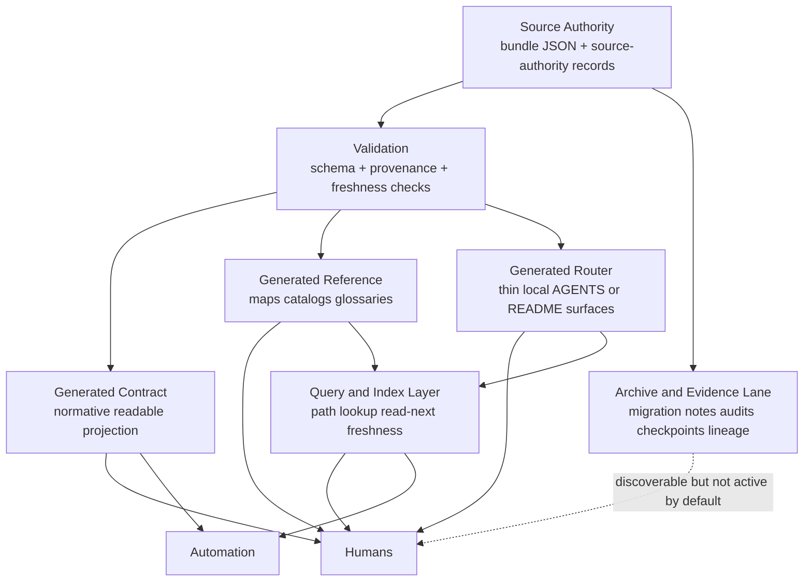

# Central Semantic Authority Template

## Overview

Central semantic authority is the part of a drift-control system that owns rule meaning. It answers a simple question without ambiguity: _where does the live meaning come from when docs, automation, and local habits disagree?_

In a mature setup, authority is not "whatever document people read most often." It is a bounded source surface with explicit ownership, explicit update rules, and explicit downstream projections.

> **Core rule**
> A readable page, index, router, generated contract, or enforcement report may explain authority, but it must not silently become authority.

| Term | Meaning | Can define live rules? | Typical edit policy |
| --- | --- | --- | --- |
| Source authority | The canonical semantic root for rules, ownership, provenance, and publication behavior | Yes | Directly editable by the owning maintainers |
| Direct authority record | An intentionally authoritative supporting source such as a decision log or exception register | Yes, if explicitly designated | Controlled, review-required |
| Generated contract | Human-readable projection of the authority surface | No, derived only | Regenerate, do not hand-edit |
| Generated reference | Maps, catalogs, glossaries, and lookup aids derived from authority | No | Regenerate, do not hand-edit |
| Router surface | Thin local guidance that tells readers where to go next | No | Regenerate or keep intentionally thin |
| Evidence or archive | Historical records, audits, migration notes, packet output, recovery checkpoints | No for active meaning | Append-only or archived |

## Why Central Authority Matters

Without a single semantic root, drift control degenerates into conflict management. The immediate problem is not missing documentation. The problem is competing meanings across policy files, generated docs, repo-local notes, CI checks, and operator memory.

| Failure mode | What it looks like | Why it is dangerous |
| --- | --- | --- |
| Shadow authority | Teams treat a generated doc or local README as the real rule source | Updates land in the wrong place and drift reappears after regeneration |
| Split authority | Multiple repos or folders define overlapping "canon" | Conflicts are resolved socially instead of deterministically |
| Untracked publication drift | Reader-facing pages lag behind the source authority | Humans implement against stale guidance |
| Retrieval drift | Search or indexing tools are mistaken for policy owners | Query behavior starts inventing or freezing meaning |
| Evidence contamination | Audit reports, migration notes, or checkpoints remain in the live authority lane | Historical context overrides current policy |

> **Operational consequence**
> If contributors cannot answer "what wins on conflict?" in one sentence, the authority model is incomplete.

## Authority Surfaces

The clean model is a lane system. One lane owns meaning. The others improve access, enforcement, or recovery without redefining the rules.

| Surface class | Primary responsibility | Allowed content | Not allowed |
| --- | --- | --- | --- |
| `authority` | Own semantic meaning, rule payload, scope boundaries, provenance model | Canon bundles, source-authority records, owned rule JSON, owned source manifests | Local summaries that bypass the authority update path |
| `publication/contract` | Publish normative human-readable views derived from authority | Generated contracts with provenance and freshness metadata | Manual edits that change meaning independently |
| `publication/reference` | Reorganize authority for discovery and operator use | Scope maps, catalogs, glossaries, generated references | New requirements not present in authority |
| `publication/router` | Keep local guidance thin and path-aware | "Read this next" pointers, boundary reminders, owning bundle IDs | Long-form restatements that become shadow canon |
| `query` | Resolve likely authority quickly | Path lookup, read-next routing, freshness and provenance display | Rule invention, silent precedence changes |
| `evidence/archive` | Preserve history, audits, migration artifacts, checkpoints | Archived reports, lineage indexes, supersession metadata | Default live authority for active behavior |

### Minimal authority contract

1. One owning semantic root per governed domain.
2. A known write path for changing live meaning.
3. Generated outputs that preserve provenance back to that root.
4. Freshness signals so stale outputs are detectable.
5. Thin routing surfaces so navigation stays fast without spawning shadow policy.
6. A separate archive lane so historical material does not stay active by accident.

## Generation Model

The recommended build model is authority-first, publication-second.

```text
authoritative sources -> canonical bundle/model -> generated contract/reference/router outputs -> query/index surfaces -> humans and automation
```

The critical distinction is this:

- Source authority is where rule meaning is authored.
- Generated outputs are where rule meaning is rendered.
- Query surfaces are where rule meaning is discovered.
- Evidence surfaces are where past rule states and rollout history are preserved.

That separation lets you regenerate safely, prove provenance, and reject manual edits in the wrong lane.

| Stage | Input | Output | Drift control expectation |
| --- | --- | --- | --- |
| Author | Bundle JSON, source-authority records, explicit authority documents | Updated canonical model | All semantic changes happen here |
| Validate | Schema and consistency checks | Pass/fail signal | Broken provenance or malformed rules block publication |
| Generate | Canonical model | Contracts, references, routers, catalogs | Outputs are deterministic and reproducible |
| Publish | Generated files at stable paths | Reader-facing docs | Public paths stay stable while authority stays centralized |
| Query | Path lookup, read-next, freshness metadata | Retrieval answers | Query layer routes to authority; it does not replace it |
| Archive | Superseded outputs and rollout evidence | Archived lineage | Historical material is discoverable but not active by default |

> **Design note**
> Stable public paths are useful. Stable public paths as hand-maintained authority are dangerous. Keep the path; change the ownership model.

### Generic file topology

```text
policy/
  canon/
    workspace-governance/
      canon-bundle.json
      source-authority.md
      source-manifest.json
      build-manifest.json
  WORKSPACE_GOVERNANCE.md          # generated contract
  README.md                        # generated reference
  POLICY_SCOPE_MAP.md              # generated reference
  AGENTS.md                        # generated router
catalog/
  PUBLICATION_CATALOG.md           # generated reference
archive/
  publication-lineage/             # archive lane, not live authority
```

## In This Repository

> **Example lane**
> The paths below are one concrete implementation example from this workspace. They illustrate the model; they are not the required layout for your repository.

This workspace uses `runbook-policy` as the semantic authority root for shared policy meaning. The authority source is not the generated contract itself. It lives under `runbook-policy/canon/**`, with the workspace-governance concepts centered on the source-authority record at `runbook-policy/canon/policy/workspace-governance/source-authority.md`.

The generated contract at `runbook-policy/WORKSPACE_GOVERNANCE.md` makes the model explicit:

- `runbook-policy` is the semantic authority for shared workspace rules.
- `runbook-app` owns implementation, not shared policy meaning.
- `runbook-tooling` owns tooling, not semantic authority.
- `.code-index` is a retrieval surface, not policy canon.
- generated `AGENTS.md`, README, scope-map, and contract pages are subordinate outputs with provenance.

The same pattern appears again in generated subordinate views such as `runbook-policy/ci/CI_ENFORCEMENT_POLICY.md` and `runbook-app/docs/ui-implementation-stages.md`: both declare the canonical bundle path, expose generated metadata, and tell readers to regenerate rather than hand-edit.

| Generic role | Workspace example | Why it matters |
| --- | --- | --- |
| Source authority | `runbook-policy/canon/policy/workspace-governance/source-authority.md` and bundle JSON under `runbook-policy/canon/**` | Live meaning is authored here |
| Generated contract | `runbook-policy/WORKSPACE_GOVERNANCE.md` | Human-readable normative projection of the authority bundle |
| Generated references | `runbook-policy/README.md`, `runbook-policy/POLICY_SCOPE_MAP.md` | Navigation and explanation without redefining policy |
| Generated router | `runbook-policy/AGENTS.md` and repo-local `AGENTS.md` outputs | Thin local routing and guardrails |
| Generated subordinate output | `runbook-app/docs/ui-implementation-stages.md` | Policy-derived guidance projected into an implementation repo |
| Query surface | `.code-index` path and docs queries | Retrieval layer, not semantic owner |
| Evidence lane | QA artifacts, migration trackers, packet outputs, archive records | Historical support material kept out of live authority |

## Mermaid Diagram



## Key Snippets

### 1. Source-authority rule shape

```md
# Workspace Governance Source Authority

- policy/ is the only semantic authority surface for shared workspace rules.
- app/ owns implementation state, not shared semantic meaning.
- tooling/ owns automation infrastructure, not policy canon.
- query/index tooling may assist retrieval, but it does not win conflicts.
```

### 2. Generated contract metadata

```yaml
---
owner: policy.workspace-governance
generated_from: policy/canon/workspace-governance/canon-bundle.json
build_manifest: policy/canon/workspace-governance/build-manifest.json
publication_doc_role: generated_contract
publication_output_family: contract
edit_policy: generated_do_not_edit
---
```

### 3. Thin authority note for a generated page

```md
Authority note:
- this document is a generated subordinate view of `policy/canon/workspace-governance`
- the JSON bundle is canonical; regenerate this file instead of editing it by hand
- live repo status is not canonical here; execution state belongs in the execution system
```

### 4. Publication record shape

```json
{
  "owning_bundle": "policy.workspace-governance",
  "target_id": "workspace-governance-contract",
  "doc_role": "generated_contract",
  "publication_output_family": "contract",
  "stable_output_path": "policy/WORKSPACE_GOVERNANCE.md",
  "lookup_visible": true,
  "freshness": "fresh",
  "read_next": [
    "policy/README.md",
    "policy/POLICY_SCOPE_MAP.md"
  ]
}
```

> **What the snippets show**
> The machine-readable bundle owns the meaning. The generated page owns readability. The metadata preserves the link between them.

## Implementation Checklist

- Choose one semantic authority root for each governed domain.
- Define the allowed direct authority records, if any, such as decisions or exceptions.
- Move rule authoring into canonical machine-readable bundles or equally explicit source-owned records.
- Generate reader-facing contracts, references, and routers from those sources.
- Attach provenance fields such as `generated_from`, `owner`, `doc_role`, `publication_output_family`, and freshness metadata.
- Mark generated outputs as `do not edit` and make regeneration the only legal update path.
- Keep router surfaces thin so they route to authority instead of restating entire policies.
- Ensure search, indexing, or query tools expose provenance and freshness without becoming semantic owners.
- Separate evidence, migration notes, audits, checkpoints, and archive lineage from the live authority lane.
- Add CI or local checks that fail on stale generated outputs, broken provenance, or hand-edited derived files.
- Define conflict resolution explicitly: authority source wins over generated docs, local notes, and query output.
- Document the update sequence: author -> validate -> regenerate -> review -> publish -> archive superseded material.

## Repo-Agnostic Build Prompt

```text
Build a central semantic-authority system for this repository that prevents drift between rule meaning, readable docs, query surfaces, and historical evidence.

Requirements:
1. Create one explicit semantic authority root for shared repository rules. If the repo already has multiple overlapping policy locations, consolidate the meaning into one owned authority lane and define conflict resolution so the authority lane always wins.
2. Distinguish these surface classes clearly:
   - source authority
   - intentionally authoritative supporting records (if any, such as decisions or exceptions)
   - generated contract outputs
   - generated reference outputs
   - thin router outputs
   - query/index surfaces
   - archive/evidence surfaces
3. Ensure generated docs never become live semantic authority. Generated contracts, references, and routers must preserve provenance back to the authority source and must be marked as regenerate-only.
4. Add freshness/provenance metadata to every generated publication, including at minimum:
   - owning bundle or authority ID
   - generated_from source path
   - build or generation manifest path
   - doc role
   - publication family
   - edit policy
   - visibility flags if the repo uses them
5. Implement a deterministic generation model:
   - author semantic changes in the authority lane
   - validate schema and provenance
   - regenerate readable outputs
   - fail if generated outputs are stale or manually edited
6. Keep router surfaces thin. They should identify local boundaries and route deeper reads into the owning contract/reference surfaces instead of duplicating long-form rules.
7. Keep query or indexing tools in a retrieval lane only. They may resolve path ownership, read-next surfaces, provenance, and freshness, but they must not invent rules or replace the authority source.
8. Create an archive/evidence lane for audits, migration notes, checkpoints, rollout artifacts, and superseded outputs so those materials remain discoverable without staying active by default.

Deliverables:
- a short architecture note explaining the authority model and conflict resolution
- the authority-root file/folder structure
- one example authority bundle or equivalent canonical source
- one generated contract page
- one generated reference page
- one thin router page
- one machine-readable publication or provenance record
- one validation or CI check that detects stale/manual edits to generated outputs
- one short README section explaining how to update authority correctly

Constraints:
- keep the model repo-agnostic and avoid assuming a specific CI provider, doc generator, or framework
- preserve any stable public doc paths if possible, but convert them into generated outputs instead of manual semantic authority
- do not leave shadow policy behind in local READMEs, agent files, or generated references
- prefer concise, explicit metadata and deterministic file ownership over broad prose

Execution guidance:
- inspect the current repo for competing policy or guidance surfaces
- identify which files are currently acting as shadow authority
- propose the target lane model before making structural changes
- implement the smallest complete vertical slice that proves the pattern
- show the final file tree, the generation flow, and the exact update path for future semantic changes
```
