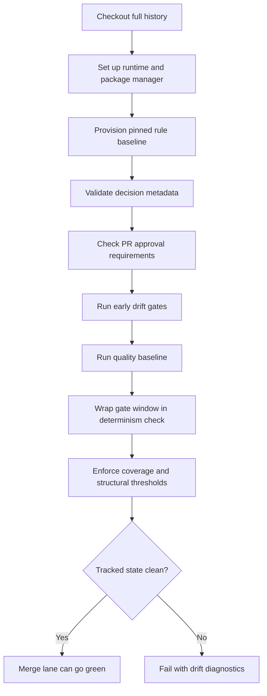

# CI Integration Template

## Overview

CI is where drift control becomes enforceable instead of aspirational. A drift-control system can define authority, publish readable guidance, and provide local guardrails, but the shared integration lane is what turns those expectations into a stable merge floor.

> **At a glance**
> Treat CI as the blocking enforcement layer, not as the semantic authority. The workflow should consume an explicit rule baseline, run narrow gate classes in a deliberate order, and fail when the gate window mutates tracked state.

| Use this page when you need to... | What this page gives you |
| --- | --- |
| turn policy into a shared merge floor | a gate-class model for CI |
| stop drift that local tooling misses | workflow order, determinism patterns, and failure classes |
| keep guidance portable | generic-first patterns with one labeled example lane |
| document the system clearly | snippets, tables, and a reusable build prompt |

### Fast model

| Layer | Job | Should define rules? |
| --- | --- | --- |
| Authority lane | own CI policy, thresholds, and review requirements | Yes |
| CI workflow | enforce the authority lane consistently | No |
| Gate scripts | implement narrow blocking checks | No |
| Determinism wrapper | prove CI does not rewrite tracked state | No |
| Reports and logs | explain failures and preserve evidence | No |

---

## Why CI Belongs In Drift Control

Drift is shared-state failure. It becomes expensive when one contributor, one branch, or one local machine can bypass checks that another change must pass. CI is the only layer that can apply a single merge standard to every governed change.

| Concern | Why local checks are not enough | Why CI is the right layer |
| --- | --- | --- |
| Rule drift | local tooling can be skipped, stale, or configured differently | CI enforces one current blocking baseline for every reviewed change |
| Determinism drift | generated files or lockfiles may mutate only on some machines | CI can compare tracked state after the full gate window runs |
| Scope drift | a valid code change can still touch the wrong surfaces | CI can compute the actual delta and reject out-of-scope edits |
| Decision drift | review context can disappear from commit history | CI can require decision metadata and approval state before merge |
| Quality floor drift | teams often remember different "minimum" checks | CI turns the floor into an explicit required gate set |

### What a healthy CI lane does

1. Freeze the rule baseline it is about to enforce.
2. Run blocking checks in a deliberate order.
3. Fail when the gate window mutates committed state.
4. Leave a readable audit trail of what standard blocked the change.

> **Design constraint**
> Do not collapse every concern into one giant script. A drift-control lane is easier to understand and maintain when each gate class has a narrow responsibility.

---

## Gate Classes

The names vary by repository. The classes stay stable.

| Gate class | What it blocks | Typical signal | Example modeled from this workspace |
| --- | --- | --- | --- |
| Baseline validation | running against an unknown or incompatible rule set | missing pin, incompatible version, floating policy source | `prepare-policy-source`, `policy-pin-freeze` |
| Decision and approval gates | high-impact changes without required metadata or review state | missing decision reference, insufficient PR approvals | decision metadata gate and release approval gate |
| Schema and contract gates | drift between code, schemas, and generated contracts | schema mismatch, broken JSON or contract shape | `schema-validate`, contract shape checks |
| Policy or canon drift gates | changes that violate authority-owned naming, routing, or publication rules | stale generated docs, broken canon, forbidden identifiers | `canon-gate`, `policy-lint` |
| Scope gates | valid changes made in the wrong surface | forbidden paths changed, boundary violation | delta-based scope gate |
| Quality baseline gates | regressions that should always block merge | lint, type, unit, integration failures | `lint`, `typecheck`, `unit-test`, `integration-test` |
| Coverage floor gates | subsystems falling below policy-set confidence floors | threshold failure, missing critical files | scoped coverage-floor gate |
| Determinism gates | CI steps that rewrite tracked state or mutate the lockfile | dirty git diff after install/build/test | lockfile plus tracked-diff validation |
| Structural gates | code surfaces that exceed maintainability limits | file too large, function too large, boundary violation | hard LOC or function caps with explicit exemption rules |

### Gate design rules

| Rule | Why it matters |
| --- | --- |
| Make the blocking baseline explicit | readers should not need to reverse-engineer the merge floor from a long helper script |
| Keep gate outputs class-specific | contributors should know whether the failure is policy, scope, determinism, quality, or coverage drift |
| Fail early on "wrong change" defects | scope, metadata, and authority drift are cheaper to detect before tests run |
| Keep determinism broad but understandable | wrap the real blocking window, not a toy subset |

---

## Workflow Shape

The workflow should read like a contract, not a pile of commands.

| Stage | Responsibility | Why it is early or late |
| --- | --- | --- |
| Checkout and runtime setup | fetch history, install runtime, restore package-manager context | downstream delta, approval, and determinism checks depend on a stable environment |
| Baseline provisioning | fetch or verify the pinned policy or rule source | every later gate should run against the same rule baseline |
| Delta-aware metadata gates | validate decision metadata and review requirements | fail quickly before expensive test work |
| Early drift gates | run canon, scope, schema, contract, and policy checks | detect wrong-change problems before bad-code problems |
| Quality baseline | lint, typecheck, unit, integration, critical snapshots | establishes the minimum engineering floor |
| Determinism wrapper | rerun or wrap the authoritative gate window inside a tracked-state check | proves the lane does not rewrite committed state |
| Coverage and structural checks | enforce confidence floors and maintainability limits | these are usually policy thresholds, not advisory reporting |

### Reference workflow skeleton

```yaml
name: quality-gates

on:
  pull_request:
  pull_request_review:
  push:
    branches: [main, dev]

jobs:
  quality-gates:
    runs-on: ubuntu-latest
    steps:
      - uses: actions/checkout@v4
        with:
          fetch-depth: 0
      - name: Set up runtime
        run: ./scripts/ci/setup-runtime.sh
      - name: Provision pinned rule baseline
        run: ./scripts/ci/prepare-rule-source.sh
      - name: Validate decision metadata
        run: ./scripts/gates/decision-metadata-gate.sh
      - name: Enforce approval requirement
        run: ./scripts/gates/release-approval-gate.sh
      - name: Run determinism-wrapped gate window
        run: ./scripts/gates/ci-determinism-gate.sh
```

### Blocking order in plain language

1. Set up the environment.
2. Freeze the rule baseline.
3. Fail quickly on metadata or approval defects.
4. Fail on scope, schema, contract, or publication drift.
5. Run the quality floor.
6. Prove the workflow did not rewrite tracked state.
7. Enforce coverage and maintainability thresholds.

---

## In This Repository

> **Example lane**
> The files and commands below are local implementation details. Reuse the structure, not the names.

This workspace maps the generic model onto an explicit policy contract, a shared workflow, and several narrow gate scripts.

| Local surface | Role in the model | Example detail |
| --- | --- | --- |
| `runbook-policy/ci/CI_ENFORCEMENT_POLICY.md` | published contract for the CI gate floor | defines the blocking baseline, coverage floors, drift checks, determinism requirement, and structural size caps |
| `runbook-app/.github/workflows/quality-gates.yml` | shared CI workflow | triggers on `pull_request`, `pull_request_review`, and pushes to `main` and `dev` |
| `node scripts/gates/decision-metadata-gate.mjs` | decision traceability gate | compares the active delta against authoritative decision metadata |
| `node scripts/gates/decision-release-approval-gate.mjs` | approval gate | requires at least one active PR approval in release-sensitive flow |
| `node scripts/gates/canon-gate.mjs` | policy or canon drift gate | rejects authority or publication drift before merge |
| `node scripts/gates/ci-determinism-gate.mjs` | determinism wrapper | runs the gate window and fails on introduced lockfile or tracked-file drift |

The policy contract in this workspace models a layered baseline:

| Policy area | Example requirement modeled here |
| --- | --- |
| Blocking baseline | `script-integrity`, `schema-validate`, `policy-lint`, `lint`, `typecheck`, `unit-test`, `integration-test` |
| Coverage floors | subsystem-specific thresholds instead of one global percentage |
| Drift checks | deprecated aliases, hardcoded lifecycle IDs, and unannotated unused exports are blocked |
| Determinism | the lockfile must not change and CI must not create tracked diffs |
| Structural gates | hard file and function size caps fail CI; exemptions must be explicit |

The workflow implements that contract by front-loading policy setup and metadata checks, then wrapping the longer command chain inside a determinism gate.

```yaml
- name: Provision pinned policy source
  run: pnpm run prepare-policy-source

- name: Validate decision metadata against authoritative canon
  run: node scripts/gates/decision-metadata-gate.mjs

- name: Enforce release approval requirement
  run: node scripts/gates/decision-release-approval-gate.mjs

- name: Run canon gate
  run: node scripts/gates/canon-gate.mjs
```

> **Portable lesson**
> The key transfer is not the command name. It is the discipline: policy setup first, metadata next, then drift gates, then the heavier quality window.

---

## Mermaid Diagram



---

## Key Snippets

> **Use these to preserve role boundaries**
> The snippets below show how to keep the authoritative gate window explicit, deterministic, and easy to diagnose.

### 1. Determinism wrapper pattern

```yaml
- name: Run quality gates
  env:
    CI_DETERMINISM_RUN: >-
      npm ci &&
      npm run policy-pin-freeze &&
      npm run schema-validate &&
      npm run policy-lint &&
      npm run lint &&
      npm run typecheck &&
      npm run unit-test &&
      npm run integration-test &&
      npm run coverage-floor-gate
  run: node scripts/gates/ci-determinism-gate.mjs
```

### 2. Drift-gate shell contract

```bash
#!/usr/bin/env bash
set -euo pipefail

before_lock="$(sha256sum package-lock.json pnpm-lock.yaml yarn.lock 2>/dev/null || true)"
before_status="$(git status --short)"

bash -lc "${CI_DETERMINISM_RUN}"

after_lock="$(sha256sum package-lock.json pnpm-lock.yaml yarn.lock 2>/dev/null || true)"
after_status="$(git status --short)"

if [[ "${before_lock}" != "${after_lock}" || "${before_status}" != "${after_status}" ]]; then
  echo "Determinism gate failed: CI introduced lockfile or tracked-file drift." >&2
  git status --short
  git diff --stat
  exit 1
fi
```

### 3. Gate-class mapping

| Generic responsibility | One possible script name | Notes |
| --- | --- | --- |
| prepare rule baseline | `prepare-rule-source` | pin branch, commit, and compatible rule version |
| decision metadata check | `decision-metadata-gate` | compare changed scope to required decision annotations |
| approval check | `release-approval-gate` | use latest review state per reviewer |
| scope drift check | `scope-gate` | compute delta from base to head |
| canon or publication drift check | `canon-gate` | detect stale generated outputs or forbidden authority drift |
| determinism check | `ci-determinism-gate` | wrap the full blocking window |

### 4. Failure-message checklist

| Failure class | Minimum useful message |
| --- | --- |
| metadata | what annotation or reference is missing |
| approval | what approval state is required and what was seen |
| scope | which paths crossed the allowed boundary |
| policy or publication | which authority rule or generated output failed |
| determinism | what tracked files changed during CI |
| coverage | which subsystem missed its threshold |
| structural | which surface exceeded the cap and whether an exemption path exists |

---

## Implementation Checklist

| Status | Item |
| --- | --- |
| `todo` | Define one authority surface for CI rules before writing workflow logic |
| `todo` | Publish a readable contract or handbook page that points back to authority |
| `todo` | Pin the policy or rule baseline used by CI |
| `todo` | Trigger on both code-change events and review-state events if approval is gated |
| `todo` | Run delta-aware metadata and scope gates before the expensive test stack |
| `todo` | Keep the blocking baseline explicit instead of hiding it inside a large helper script |
| `todo` | Wrap the gate window in a determinism check that compares tracked state |
| `todo` | Enforce coverage by subsystem or critical surface where one global threshold is misleading |
| `todo` | Fail structural overages with explicit exemption rules rather than silent waivers |
| `todo` | Emit failure messages that tell contributors whether the issue is scope, policy, determinism, quality, or coverage drift |

> **Failure-mode test**
> Before calling the system complete, intentionally trigger one failure in each class. If a contributor cannot tell what failed and how to fix it from CI output alone, the gate design is still too opaque.

---

## Repo-Agnostic Build Prompt

```text
You are working in a repository that needs a CI-based drift-control gate system. Build a generic, policy-aligned implementation without assuming any specific framework, language, package manager, or directory layout.

Goal:
- Create a shared CI workflow that blocks merge on drift-control violations, quality regressions, determinism failures, and missing review metadata.
- Keep the system generic-first: use local repo names and paths only after discovering them.
- Treat CI as an enforcement layer, not the authority source. If no authority document exists yet, create a minimal machine-readable or clearly owned authority surface for CI rules and reference it from the workflow docs.

Required outputs:
- one CI workflow file for GitHub Actions that runs on pull requests, review-state changes, and protected-branch pushes
- small gate scripts or commands for:
  - rule-baseline preparation or verification
  - decision-metadata validation
  - review-approval validation
  - scope or changed-files validation
  - policy or publication drift detection
  - determinism checking
  - coverage-floor enforcement
  - structural size or boundary enforcement
- one repository-facing markdown document explaining the CI drift-control model, gate classes, workflow shape, and operator expectations
- package or task-runner entrypoints so the workflow calls stable script names instead of embedding all logic inline

Implementation constraints:
- discover the repository structure first; do not invent paths if equivalent local surfaces already exist
- keep each gate narrow and composable; do not hide unrelated concerns inside one giant script
- make the blocking baseline explicit and ordered
- add a determinism wrapper that captures git tracked state before and after the gate window and fails if the run changes the lockfile or introduces tracked diffs
- if approval logic depends on pull-request reviews, count the latest review state per reviewer rather than raw review events
- if coverage expectations differ by subsystem, implement scoped thresholds rather than a single global floor
- emit readable failure messages that distinguish policy drift, scope drift, determinism drift, coverage failure, structural failure, and metadata failure
- prefer portable shell or Node-based scripts unless the repo already has a strong house standard

Suggested workflow order:
1. Checkout with full history.
2. Set up the repo runtime and dependency manager.
3. Prepare or verify the pinned rule baseline.
4. Run decision-metadata and approval gates.
5. Run scope, policy or publication, schema, and contract gates.
6. Run lint, typecheck, unit, and integration checks.
7. Run coverage and structural gates.
8. Wrap the authoritative gate window in a determinism check.

Deliver the work end-to-end:
- inspect the repo
- add or update the workflow and scripts
- document how the system works
- run the relevant validation commands if available
- summarize the files changed, the gate order, and any assumptions that still need a maintainer decision
```
