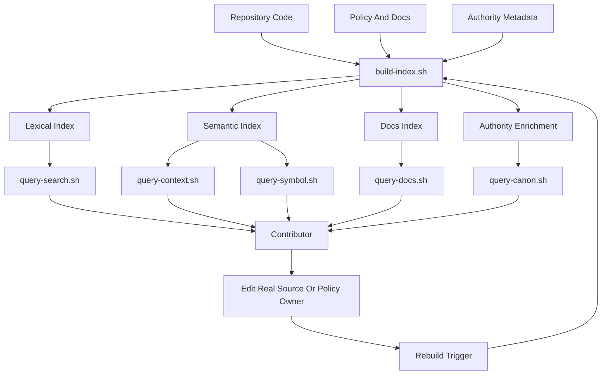

# Code Index Template

This page is a reusable pattern for building a local `code-index` system that reduces drift during engineering work. It is written generic-first so teams can transplant the model into another repository without inheriting local names, paths, or governance structure.

> **Example lane.**
> The callouts labeled "In this repository" show how one workspace applies the pattern with `.code-index/`, `runbook-policy/`, and `runbook-app/`. Treat those callouts as examples, not prerequisites.

## Overview

A local code index is a workspace-owned retrieval layer that helps contributors answer three questions quickly:

1. What files, symbols, or docs are relevant?
2. What authority surface governs this path or change?
3. How do I rebuild retrieval state when it goes stale?

The model works best when indexing stays operational and local, while semantic authority stays somewhere else. The index should accelerate discovery, not become a shadow policy store.

> **Keep the boundary hard.**
> Retrieval tooling can assemble context, surface provenance, and resolve paths. It should not become the place where rule meaning is authored.

## Why It Matters

| Drift problem | What usually goes wrong | What a local code index changes |
| --- | --- | --- |
| Authority drift | People implement against stale summaries, chat fragments, or nearby files | Path-aware lookup points them back to the governing contract or source bundle |
| Search drift | Contributors start with broad scans and open too many files | Indexed retrieval narrows to a small candidate set first |
| Context drift | Symbol references, docs, and policy are discovered through separate ad hoc steps | One local surface exposes code, docs, symbols, and authority routing together |
| Freshness drift | Generated indexes silently age out after checkout or policy changes | Rebuild triggers and manual repair commands keep retrieval state current |
| Coordination drift | Different operators use different lookup habits | The retrieval order becomes an explicit working contract |

## Core Parts

| Part | Generic role | Minimum implementation | Example lane in this repository |
| --- | --- | --- | --- |
| Build orchestrator | Regenerates all retrieval artifacts in one place | `./.code-index/build-index.sh` with strict shell mode and ordered build steps | `.code-index/build-index.sh` builds SCIP, Zoekt, graphs, docs, and canon enrichment |
| Lexical index | Fast substring and regex search over repo content | Zoekt, ripgrep-backed cache, or another local search engine | `.code-index/zoekt/` with `query-search.sh` |
| Semantic index | Symbol, call-graph, or dependency lookup | SCIP, LSIF, ctags, tree-sitter, or language-native indexers | `.code-index/scip/index.scip` plus graph builders |
| Docs index | Searchable view of policy, architecture, and operator docs | JSON or SQLite index over Markdown and similar docs | `.code-index/docs/docs-index.json` queried by `query-docs.sh` |
| Authority enrichment | Path-to-rule or path-to-contract completion | Metadata that maps paths to owning bundles, rules, and provenance | `.code-index/graphs/canon-enrichment.json` queried by `query-canon.sh` |
| Query entrypoints | Thin stable CLI wrappers | Small scripts that call the real query implementations | `query-context.sh`, `query-search.sh`, `query-docs.sh`, `query-canon.sh` |
| Update automation | Keeps indexes current after meaningful repo movement | Hook-driven and manual rebuild paths | Rebuild triggers include commit change, policy change, manual reindex, and maintenance reindex |
| Reliability posture | Prevents tooling from becoming a blocker or authority | Supportive by default, explicit about freshness and failure semantics | Current policy treats indexing as supportive unless a separate gate says otherwise |

## How It Works

The operating loop is simple:

1. A contributor starts with indexed retrieval rather than broad filesystem scans.
2. Thin query wrappers hit local artifacts built by the orchestrator.
3. Search and symbol results narrow the working set to a few candidate files.
4. Path-aware lookup resolves the governing authority surface for the file being changed.
5. If the index is stale, the operator runs one rebuild entrypoint instead of repairing each artifact manually.
6. Automation refreshes the index after meaningful changes so drift stays bounded.

| Stage | Generic action | Design rule |
| --- | --- | --- |
| Retrieve | `query-context`, `query-search`, `query-docs` | Start local and indexed; do not open the whole repo first |
| Resolve | `query-canon --compact --path`, then `--path` | Treat path lookup as completion, not as a second authority source |
| Narrow | Reduce to 2 to 5 files | Retrieval should shrink the search surface before deep reads |
| Change | Edit the actual source or policy owner | Never author rule meaning inside generated index artifacts |
| Refresh | Rebuild the index when triggers fire | One orchestrator should own the artifact rebuild sequence |

> **Retrieval order matters.**
> A good local index is not just a pile of artifacts. It is a repeatable operator workflow: context first, search second, docs before broad policy reads, then path completion and symbol or impact lookup as needed.

## In This Repository

This repository family uses the pattern below. The names are local; the architecture is portable.

| Generic concept | Local example | Notes |
| --- | --- | --- |
| Local retrieval root | `.code-index/` | Workspace-local tooling and generated retrieval evidence |
| Product code being indexed | `runbook-app/` | Primary code surface for lexical and semantic indexing |
| Policy and architecture docs | `runbook-policy/` | Source of published contracts and policy references |
| Retrieval contract | `runbook-policy/code-index/INDEX_FIRST_RETRIEVAL.md` | Declares the index-first query order and fallback rules |
| Automation contract | `runbook-policy/code-index/INDEXING_AUTOMATION.md` | Declares rebuild triggers, hook behavior, and reliability framing |
| Build artifacts | `scip/`, `zoekt/`, `graphs/`, `docs/docs-index.json` | Generated evidence consumed by query commands |

> **In this repository.**
> The retrieval contract explicitly says not to start with `rg`, `grep`, `find`, or broad recursive scans. The automation contract keeps `.code-index/build-index.sh` as a workspace-local rebuild orchestrator and keeps canon ownership under `runbook-policy/`.

## Mermaid Diagram



## Key Snippets

The snippets below are genericized, but each one is modeled on the current workspace implementation and policy contracts.

### 1. Build Orchestrator

Modeled on `.code-index/build-index.sh`.

```bash
#!/usr/bin/env bash
set -euo pipefail

ROOT="$(cd "$(dirname "${BASH_SOURCE[0]}")" && pwd)"
REPO_ROOT="$(cd "$ROOT/.." && pwd)"
CODE_ROOT="$REPO_ROOT/<code-root>"
DOCS_ROOT="$REPO_ROOT/<docs-root>"
LOCK_PATH="$ROOT/.build-index.lock"

mkdir -p "$ROOT/scip" "$ROOT/search" "$ROOT/graphs" "$ROOT/docs"

exec 9>"$LOCK_PATH"
if ! flock -n 9; then
  echo "==> index build already running; waiting for lock"
  flock 9
fi

echo "==> building semantic index"
<semantic-index-command> --output "$ROOT/scip/index.scip"

echo "==> building lexical index"
<lexical-index-command> "$CODE_ROOT" --out "$ROOT/search"

echo "==> building graphs and docs index"
node "$ROOT/scripts/build-graphs.mjs" "$CODE_ROOT" "$ROOT/scip/index.scip" "$ROOT/graphs"
node "$ROOT/scripts/build-docs.mjs" "$DOCS_ROOT" "$CODE_ROOT" "$ROOT/docs/docs-index.json"

echo "==> building authority enrichment"
node "$ROOT/scripts/build-authority-map.mjs" "$REPO_ROOT/<authority-root>" "$ROOT/graphs/authority-map.json"
```

### 2. Thin Query Wrappers

Modeled on `.code-index/query-context.sh`, `.code-index/query-docs.sh`, and `.code-index/query-canon.sh`.

```bash
#!/usr/bin/env bash
set -euo pipefail

ROOT="$(cd "$(dirname "${BASH_SOURCE[0]}")" && pwd)"
export NODE_PATH="$ROOT/tooling/node_modules${NODE_PATH:+:$NODE_PATH}"

node "$ROOT/scripts/query-docs.mjs" "$@"
```

```bash
#!/usr/bin/env bash
set -euo pipefail

ROOT="$(cd "$(dirname "${BASH_SOURCE[0]}")" && pwd)"

python3 "$ROOT/scripts/query-context.py" "$@"
```

```bash
#!/usr/bin/env bash
set -euo pipefail

ROOT="$(cd "$(dirname "${BASH_SOURCE[0]}")" && pwd)"
export NODE_PATH="$ROOT/tooling/node_modules${NODE_PATH:+:$NODE_PATH}"

node "$ROOT/scripts/query-canon.mjs" "$@"
```

### 3. Retrieval Order

Modeled on the `INDEX_FIRST_RETRIEVAL.md` contract.

```bash
./.code-index/query-context.sh "lifecycle bootstrap"
./.code-index/query-search.sh "lifecycle bootstrap"
./.code-index/query-docs.sh "architecture conventions"
./.code-index/query-canon.sh --compact --path "path/to/file"
./.code-index/query-canon.sh --path "path/to/file"
```

### 4. Rebuild Trigger Policy

Modeled on the `INDEXING_AUTOMATION.md` contract.

```text
Trigger a rebuild when:
- the relevant commit or checkout changes the working tree baseline
- the policy or authority version changes
- an operator explicitly requests reindexing
- scheduled maintenance runs refresh stale retrieval artifacts
```

> **Design note.**
> The workspace example keeps indexing failures supportive rather than authoritative for core execution. That is usually the right default unless your repository has a separate gate that intentionally promotes index freshness to a blocking requirement.

## Implementation Checklist

- [ ] Choose one authority root for rule meaning and keep the index outside that ownership lane.
- [ ] Create a workspace-local `.code-index/` directory with one orchestrator script and thin query wrappers.
- [ ] Build at least one lexical index, one semantic or structural index, one docs index, and one authority-enrichment artifact.
- [ ] Make `build-index.sh` serialize concurrent runs so hooks and manual rebuilds cannot corrupt partially written artifacts.
- [ ] Define a retrieval order that starts with indexed context and docs before raw broad scans.
- [ ] Support path-aware completion so contributors can ask what governs a file, not just where a string appears.
- [ ] Document rebuild triggers: commit or checkout movement, authority changes, manual repair, and scheduled refresh.
- [ ] State failure semantics explicitly so the index does not accidentally become a hidden blocker or hidden authority source.
- [ ] Keep generated routing surfaces thin; point back to the real authority contracts instead of copying them.
- [ ] Verify that a new contributor can resolve one code path, one docs question, and one authority question without improvising commands.

## Repo-Agnostic Build Prompt

Paste the prompt below into a CLI coding agent when you want it to build a similar system in another repository.

```text
Build a workspace-local `.code-index` system for this repository.

Goals:
- Create a local-first retrieval layer that helps contributors find relevant code, docs, symbols, and governing authority without starting with broad recursive scans.
- Keep `.code-index` supportive and operational only. Do not move semantic authority into it.
- Make the design generic and maintainable so another operator can understand the retrieval order and rebuild process from the repo itself.

Required deliverables:
- `.code-index/build-index.sh`
- `.code-index/query-context.sh`
- `.code-index/query-search.sh`
- `.code-index/query-docs.sh`
- `.code-index/query-canon.sh`
- Any supporting scripts, config, or generated artifact directories needed to make those entrypoints work
- One readable docs page that explains the local code-index architecture, rebuild triggers, retrieval order, and authority boundary

Implementation requirements:
- Inspect the repository first and infer the main code roots, docs or policy roots, and any existing authority surfaces before editing.
- Use one orchestrator script to rebuild all index artifacts in sequence.
- Add strict shell mode (`set -euo pipefail`) to shell entrypoints.
- Serialize rebuilds with a lock so concurrent hook or manual runs cannot produce partially written artifacts.
- Build:
  - a lexical search index for fast local text lookup
  - a semantic or structural index appropriate for the repo's main language stack
  - a docs index for Markdown or other authority-facing documentation
  - a path-aware authority or provenance map so a user can ask what governs a file path
- Make the query entrypoints thin wrappers that delegate to the actual implementation scripts.
- Support a retrieval order like:
  1. `query-context`
  2. `query-search`
  3. `query-docs`
  4. `query-canon --compact --path`
  5. `query-canon --path`
  6. symbol, reference, and impact queries if appropriate
- Treat raw `rg` or broad scans as fallback behavior, not the default workflow.
- If the repo already has hooks or automation, wire rebuilds into meaningful triggers such as checkout changes, commit changes, authority or policy version changes, manual reindexing, and scheduled refresh.
- Keep the docs explicit that `.code-index` is retrieval infrastructure, not the source of truth for rules or policy.
- Reuse existing tools already present in the repo where practical; otherwise choose lightweight local dependencies that fit the repo's language stack.
- Do not overwrite unrelated edits. Preserve existing behavior unless the change is required for the code-index system to function.

Verification requirements:
- Run the build entrypoint if feasible.
- Demonstrate at least one successful query against code, one against docs, and one path-aware authority lookup, or explain precisely what is blocked.
- Summarize changed files, commands run, and any residual gaps or assumptions.
```
