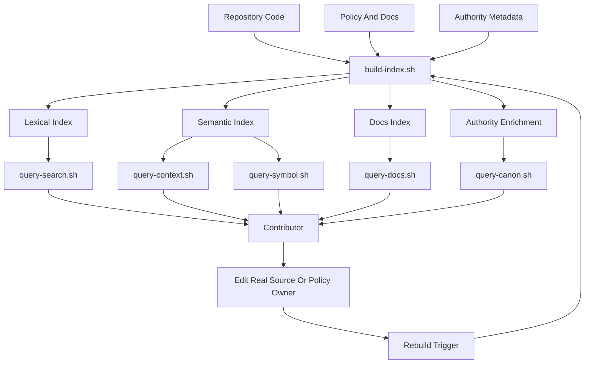

# Code Index Template

This page is a reusable pattern for building a local `code-index` system that helps contain drift during engineering work. It stays generic-first so teams can transplant the design into another repository without inheriting local names, paths, or governance choices.

> **Summary**
> A good local code index should help contributors answer four questions quickly:
> - what code or docs matter here
> - what authority governs this path
> - how to narrow the search surface before reading deeply
> - how to rebuild retrieval state when it becomes stale

> **Example lane**
> The callouts labeled "In this repository" show one concrete mapping built around `.code-index/`, `runbook-policy/`, and `runbook-app/`. Treat that lane as illustrative, not required.

## Overview

| Attribute | Generic expectation |
| --- | --- |
| Ownership | workspace-local retrieval tooling |
| Purpose | accelerate discovery, path resolution, and context gathering |
| Non-goal | become the source of truth for policy or rule meaning |
| Core output | local search, symbol, docs, and authority-completion surfaces |
| Operator value | faster retrieval with less search drift and less authority drift |

A local code index is most useful when it stays operational and subordinate. It should assemble context, expose provenance, and shrink the candidate file set. It should not become a shadow policy system.

> **Boundary rule**
> Retrieval infrastructure may resolve authority. It should not author authority.

---

## Why It Matters

| Drift problem | Common failure mode | What the code index changes |
| --- | --- | --- |
| authority drift | implementation starts from nearby files, stale summaries, or chat fragments | path-aware lookup routes contributors back to the governing contract or source bundle |
| search drift | contributors begin with broad scans and open too many files | indexed retrieval narrows the working set before deep reads |
| context drift | code, docs, symbols, and rules are found through separate improvised steps | one local surface exposes those lanes through stable entrypoints |
| freshness drift | generated lookup artifacts age out after checkout or policy movement | rebuild triggers and one manual repair path keep retrieval state current |
| coordination drift | different operators use different search habits | the retrieval order becomes an explicit shared workflow |

### The Operating Benefit

- lower time-to-context for new contributors
- fewer accidental edits against secondary or stale guidance
- more consistent handoffs because retrieval steps are named and repeatable
- less temptation to treat raw recursive search as the default discovery tool

---

## Core Parts

| Part | Generic role | Minimum implementation | Example lane in this repository |
| --- | --- | --- | --- |
| Build orchestrator | rebuild every retrieval artifact from one entrypoint | `./.code-index/build-index.sh` with strict shell mode and ordered stages | `.code-index/build-index.sh` rebuilds SCIP, Zoekt, graphs, docs, and canon enrichment |
| Lexical index | fast substring and regex lookup | Zoekt, ripgrep-backed cache, or similar local search engine | `.code-index/zoekt/` queried through `query-search.sh` |
| Semantic index | symbol, call, or dependency resolution | SCIP, LSIF, ctags, tree-sitter, or language-native indexers | `.code-index/scip/index.scip` plus graph builders |
| Docs index | searchable view of architecture, policy, and operator docs | JSON, SQLite, or other local docs index | `.code-index/docs/docs-index.json` queried by `query-docs.sh` |
| Authority enrichment | path-to-rule or path-to-contract completion | metadata that maps repo paths to governing bundles, rules, and provenance | `.code-index/graphs/canon-enrichment.json` queried by `query-canon.sh` |
| Query entrypoints | stable thin operator commands | wrapper scripts that delegate to the real implementation | `query-context.sh`, `query-search.sh`, `query-docs.sh`, `query-canon.sh` |
| Update automation | keeps artifacts fresh after meaningful repo movement | hook-driven and manual rebuild triggers | current example uses commit change, policy change, manual reindex, and maintenance refresh |
| Reliability posture | prevents tooling from becoming hidden authority or hidden blocker | supportive by default, explicit about freshness and failure semantics | current policy keeps indexing supportive unless another gate says otherwise |

### Minimum Viable Stack

If you need the smallest useful version, build these first:

1. one rebuild orchestrator
2. one lexical index
3. one docs index
4. one path-aware authority map
5. thin query wrappers with a documented retrieval order

---

## How It Works

### Retrieval Loop

1. Start with indexed context instead of raw broad scans.
2. Use stable query wrappers to hit local artifacts.
3. Narrow to a small candidate set before opening files deeply.
4. Resolve the governing authority surface for the target path.
5. Refresh the index from one orchestrator when retrieval becomes stale.

| Stage | Generic action | Design rule |
| --- | --- | --- |
| Retrieve | `query-context`, `query-search`, `query-docs` | start local and indexed; avoid opening the whole repo first |
| Resolve | `query-canon --compact --path`, then `--path` | treat path lookup as completion, not as a second authority source |
| Narrow | reduce to 2 to 5 files | retrieval should shrink the work surface before detailed reading |
| Change | edit the real source or policy owner | never author meaning inside generated index artifacts |
| Refresh | rebuild when triggers fire | one orchestrator should own artifact regeneration |

### Retrieval Order

The order matters because it shapes operator behavior:

- `query-context` should expose likely code and docs candidates
- `query-search` should cover fast lexical follow-up without broad scans
- `query-docs` should front-load policy and architecture questions
- `query-canon --compact --path` should provide terse path completion
- `query-canon --path` should provide the fuller answer with provenance and applicable rules

> **Short rule**
> Context first. Docs before broad policy reads. Path completion before ad hoc interpretation.

---

## In This Repository

This repository family uses the design below. The names are local; the architecture is portable.

| Generic concept | Local example | Why it matters |
| --- | --- | --- |
| local retrieval root | `.code-index/` | keeps retrieval tooling in one workspace-local lane |
| product code surface | `runbook-app/` | primary code indexed for search and semantic queries |
| policy and architecture docs | `runbook-policy/` | published contracts and source guidance live here |
| retrieval contract | `runbook-policy/code-index/INDEX_FIRST_RETRIEVAL.md` | defines query order, fallback rules, and path completion behavior |
| automation contract | `runbook-policy/code-index/INDEXING_AUTOMATION.md` | defines rebuild triggers, hook behavior, and reliability posture |
| generated build artifacts | `scip/`, `zoekt/`, `graphs/`, `docs/docs-index.json` | retrieval evidence consumed by the query entrypoints |

> **In this repository**
> The retrieval contract explicitly rejects `rg`, `grep`, `find`, and broad recursive scans as the starting point. The automation contract keeps `.code-index/build-index.sh` as a workspace-local rebuild orchestrator and keeps canon ownership under `runbook-policy/`.

---

## Mermaid Diagram



---

## Key Snippets

The snippets below are genericized, but each one is modeled on the current workspace implementation and the published retrieval and automation contracts.

| Snippet | Purpose |
| --- | --- |
| build orchestrator | regenerate the artifact set from one command |
| thin query wrappers | keep stable operator entrypoints while internal implementations evolve |
| retrieval order | standardize the first retrieval moves |
| rebuild triggers | clarify when fresh index state is required |

### 1. Build Orchestrator

Modeled on `.code-index/build-index.sh`.

```bash
#!/usr/bin/env bash
set -euo pipefail

ROOT="$(cd "$(dirname "${BASH_SOURCE[0]}")" && pwd)"
REPO_ROOT="$(cd "$ROOT/.." && pwd)"
CODE_ROOT="$REPO_ROOT/<code-root>"
DOCS_ROOT="$REPO_ROOT/<docs-root>"
LOCK_PATH="$ROOT/.build-index.lock"

mkdir -p "$ROOT/scip" "$ROOT/search" "$ROOT/graphs" "$ROOT/docs"

exec 9>"$LOCK_PATH"
if ! flock -n 9; then
  echo "==> index build already running; waiting for lock"
  flock 9
fi

echo "==> building semantic index"
<semantic-index-command> --output "$ROOT/scip/index.scip"

echo "==> building lexical index"
<lexical-index-command> "$CODE_ROOT" --out "$ROOT/search"

echo "==> building graphs and docs index"
node "$ROOT/scripts/build-graphs.mjs" "$CODE_ROOT" "$ROOT/scip/index.scip" "$ROOT/graphs"
node "$ROOT/scripts/build-docs.mjs" "$DOCS_ROOT" "$CODE_ROOT" "$ROOT/docs/docs-index.json"

echo "==> building authority enrichment"
node "$ROOT/scripts/build-authority-map.mjs" "$REPO_ROOT/<authority-root>" "$ROOT/graphs/authority-map.json"
```

> **Why this matters**
> One orchestrator is easier to trust, easier to automate, and easier to repair than a set of loosely documented per-artifact commands.

### 2. Thin Query Wrappers

Modeled on `.code-index/query-context.sh`, `.code-index/query-docs.sh`, and `.code-index/query-canon.sh`.

```bash
#!/usr/bin/env bash
set -euo pipefail

ROOT="$(cd "$(dirname "${BASH_SOURCE[0]}")" && pwd)"
export NODE_PATH="$ROOT/tooling/node_modules${NODE_PATH:+:$NODE_PATH}"

node "$ROOT/scripts/query-docs.mjs" "$@"
```

```bash
#!/usr/bin/env bash
set -euo pipefail

ROOT="$(cd "$(dirname "${BASH_SOURCE[0]}")" && pwd)"

python3 "$ROOT/scripts/query-context.py" "$@"
```

```bash
#!/usr/bin/env bash
set -euo pipefail

ROOT="$(cd "$(dirname "${BASH_SOURCE[0]}")" && pwd)"
export NODE_PATH="$ROOT/tooling/node_modules${NODE_PATH:+:$NODE_PATH}"

node "$ROOT/scripts/query-canon.mjs" "$@"
```

> **Why thin wrappers help**
> Operators learn stable commands once, while the underlying implementation can evolve without rewriting every doc and workflow.

### 3. Retrieval Order

Modeled on the `INDEX_FIRST_RETRIEVAL.md` contract.

```bash
./.code-index/query-context.sh "lifecycle bootstrap"
./.code-index/query-search.sh "lifecycle bootstrap"
./.code-index/query-docs.sh "architecture conventions"
./.code-index/query-canon.sh --compact --path "path/to/file"
./.code-index/query-canon.sh --path "path/to/file"
```

### 4. Rebuild Trigger Policy

Modeled on the `INDEXING_AUTOMATION.md` contract.

```text
Trigger a rebuild when:
- the relevant commit or checkout changes the working tree baseline
- the policy or authority version changes
- an operator explicitly requests reindexing
- scheduled maintenance runs refresh stale retrieval artifacts
```

> **Design note**
> The workspace example keeps indexing failures supportive rather than authoritative for core execution. That is usually the right default unless a separate gate intentionally promotes index freshness to a blocking requirement.

---

## Implementation Checklist

### Authority And Boundaries

- [ ] choose one authority root for rule meaning and keep the index outside that ownership lane
- [ ] state explicitly that the index resolves authority but does not define it
- [ ] keep generated routing surfaces thin and point them back to the real authority contracts

### Artifacts And Entry Points

- [ ] create a workspace-local `.code-index/` directory with one orchestrator script and thin query wrappers
- [ ] build at least one lexical index, one semantic or structural index, one docs index, and one authority-enrichment artifact
- [ ] make `build-index.sh` serialize concurrent runs so hooks and manual rebuilds cannot corrupt partially written artifacts

### Workflow And Reliability

- [ ] define a retrieval order that starts with indexed context and docs before raw broad scans
- [ ] support path-aware completion so contributors can ask what governs a file, not just where a string appears
- [ ] document rebuild triggers for commit or checkout movement, authority changes, manual repair, and scheduled refresh
- [ ] state failure semantics explicitly so the index does not accidentally become a hidden blocker or hidden authority source
- [ ] verify that a new contributor can resolve one code path, one docs question, and one authority question without improvising commands

---

## Repo-Agnostic Build Prompt

Paste the prompt below into a CLI coding agent when you want it to build a similar system in another repository.

```text
Build a workspace-local `.code-index` system for this repository.

Goals:
- Create a local-first retrieval layer that helps contributors find relevant code, docs, symbols, and governing authority without starting with broad recursive scans.
- Keep `.code-index` supportive and operational only. Do not move semantic authority into it.
- Make the design generic and maintainable so another operator can understand the retrieval order and rebuild process from the repo itself.

Required deliverables:
- `.code-index/build-index.sh`
- `.code-index/query-context.sh`
- `.code-index/query-search.sh`
- `.code-index/query-docs.sh`
- `.code-index/query-canon.sh`
- Any supporting scripts, config, or generated artifact directories needed to make those entrypoints work
- One readable docs page that explains the local code-index architecture, rebuild triggers, retrieval order, and authority boundary

Implementation requirements:
- Inspect the repository first and infer the main code roots, docs or policy roots, and any existing authority surfaces before editing.
- Use one orchestrator script to rebuild all index artifacts in sequence.
- Add strict shell mode (`set -euo pipefail`) to shell entrypoints.
- Serialize rebuilds with a lock so concurrent hook or manual runs cannot produce partially written artifacts.
- Build:
  - a lexical search index for fast local text lookup
  - a semantic or structural index appropriate for the repo's main language stack
  - a docs index for Markdown or other authority-facing documentation
  - a path-aware authority or provenance map so a user can ask what governs a file path
- Make the query entrypoints thin wrappers that delegate to the actual implementation scripts.
- Support a retrieval order like:
  1. `query-context`
  2. `query-search`
  3. `query-docs`
  4. `query-canon --compact --path`
  5. `query-canon --path`
  6. symbol, reference, and impact queries if appropriate
- Treat raw `rg` or broad scans as fallback behavior, not the default workflow.
- If the repo already has hooks or automation, wire rebuilds into meaningful triggers such as checkout changes, commit changes, authority or policy version changes, manual reindexing, and scheduled refresh.
- Keep the docs explicit that `.code-index` is retrieval infrastructure, not the source of truth for rules or policy.
- Reuse existing tools already present in the repo where practical; otherwise choose lightweight local dependencies that fit the repo's language stack.
- Do not overwrite unrelated edits. Preserve existing behavior unless the change is required for the code-index system to function.

Verification requirements:
- Run the build entrypoint if feasible.
- Demonstrate at least one successful query against code, one against docs, and one path-aware authority lookup, or explain precisely what is blocked.
- Summarize changed files, commands run, and any residual gaps or assumptions.
```
