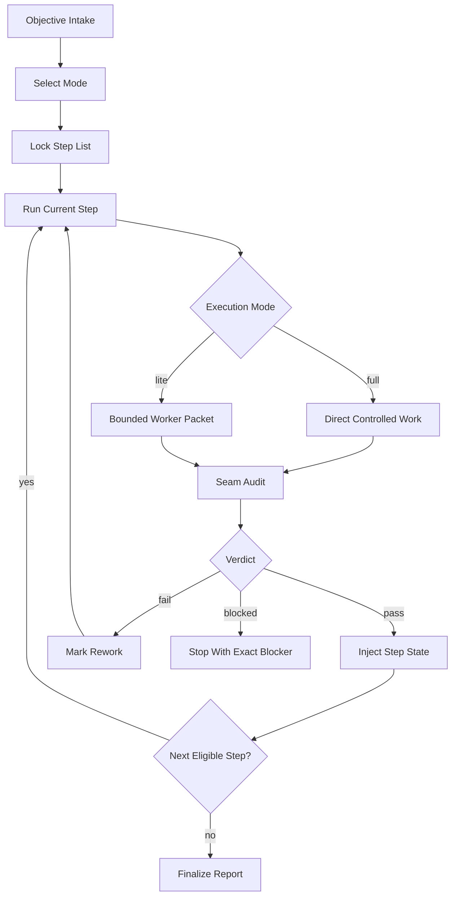

# tempgo Protocol Template

This page describes a packetized protocol for multi-step technical work. The point of the model is simple: when a task is broad, risky, resumable, or likely to drift, the work should not live only in chat memory. It should live in a bounded workstream with explicit steps, explicit ownership, machine-readable state, and seam audits between slices.

> **Summary**
> A usable tempgo-style protocol needs:
> - a full orchestrator that owns sequence and stop conditions
> - bounded worker packets for narrow execution slices
> - seam audits between completed slices
> - a step list plus step-state file as the continuity source of truth

> **Generic-first rule**
> Treat the protocol as a reusable control pattern. Repository-specific paths, scripts, and policy docs are implementation details layered on top, not the protocol itself.

## Overview

| Artifact | Role | Why it exists | Typical format |
| --- | --- | --- | --- |
| protocol page | defines the execution contract | stops teams from improvising process per task | Markdown |
| workstream or step list | declares order, dependencies, ownership, and audit boundaries | makes continuation rules explicit | Markdown or YAML |
| step state | stores runtime truth for the current workstream | lets a paused or transferred session resume without guessing | JSON |
| seam audit | verifies a completed slice before continuation | stops silent drift between packets | Markdown or JSON |

The core operating rule is straightforward: broad work is orchestrated by a parent packet, narrow work is executed by tightly bounded child packets, every handoff crosses an audit seam, and sequence authority remains in the step list and step state rather than in conversation.

> **What this prevents**
> This model is designed to stop scope creep, hidden dependency drift, conversational plan loss, and false confidence after partial implementation.

---

## Operating Modes

Use distinct packet modes instead of one oversized prompt shape.

| Mode | Use when | Must own | Must return | Escalate when |
| --- | --- | --- | --- | --- |
| `full` orchestrator | multi-step, cross-surface, risky, or resumable work | sequence, baseline discipline, next-task selection, audit gating | updated step state, audit result, next task selection | scope widens, blockers appear, or audit fails |
| `lite` worker | one bounded slice with low ambiguity | one owned surface or tightly coupled slice | tight handoff report: outputs, checks, blockers, residual risks, next-step constraints | hidden dependencies or cross-surface expansion appears |
| `audit` seam check | after each completed slice or checkpoint | scope compliance, acceptance status, seam compatibility, next-step readiness | `pass`, `fail`, or `blocked` with findings and handoff data | independent review is required or confidence is low |
| `step-list` authority | whenever work has more than one meaningful step | order, dependencies, stop conditions, audit boundaries, ownership | canonical sequence and current runtime state | never replaced by chat memory |

### Mode Selection Rules

- use `full` when the next action depends on sequence control or cross-step state
- use `lite` only when one slice is genuinely bounded and has one clear owner
- use `audit` after every meaningful completion seam
- use `step-list` whenever resumption would be unsafe without a declared order

### Trigger Language

```text
full: protocol-name: <multi-step objective>
lite: protocol-name-lite: <bounded task>
audit: protocol-name-audit: <checkpoint or completed slice>
```

---

## Workstream Shape

The workstream should behave like a loop, not a one-shot prompt burst.

| Phase | Full orchestrator responsibility | Durable output |
| --- | --- | --- |
| Intake | restate objective, owned scope, forbidden scope, required references, stop conditions | packet header |
| Mode selection | decide whether the next slice is `full`, `lite`, or `blocked` | mode declaration |
| Step-list lock | approve or update the ordered plan before execution | step list |
| Preflight | verify baseline, branch or revision alignment, prerequisites, and open blockers | preflight record |
| Execute | run the current bounded slice only | worker output or direct change |
| Seam audit | verify acceptance, scope compliance, and next-step safety | audit result |
| State inject | write execution and audit truth back into machine-readable state | step state JSON |
| Continue or stop | select the next eligible task or halt with a concrete reason | next-action decision |

### Minimal Loop

1. Lock sequence.
2. Execute one bounded slice.
3. Audit the seam.
4. Inject state.
5. Continue only if the next slice is still well-defined.

> **Continuation rule**
> Resume from the step state file, not from memory and not from the last chat message.

---

## Step List And State Model

The step list is the static plan. The step state is the live record. They need to agree on identifiers, dependencies, and audit boundaries.

### Step List Fields

| Field | Required | Purpose |
| --- | --- | --- |
| `step_id` | Yes | stable identifier used by state and audit outputs |
| `title` | Yes | human-readable description of the slice |
| `mode` | Yes | `full`, `lite`, or another explicitly defined mode |
| `depends_on` | Yes | prevents invalid out-of-order execution |
| `owned_scope` | Yes | defines the exact files, modules, or surfaces the slice may touch |
| `acceptance_checks` | Yes | defines how completion is judged |
| `audit_boundary` | Yes | states whether a seam audit is mandatory before continuation |
| `stop_conditions` | Yes | forces an explicit return when assumptions break |

### Runtime State Fields

| Field | Meaning |
| --- | --- |
| `status` | current lifecycle state for the step |
| `attempt` | retry counter for the current step |
| `last_worker_packet` | identifier or path for the most recent execution packet |
| `last_audit_verdict` | `pass`, `fail`, `blocked`, or `not_run` |
| `blockers` | facts preventing continuation |
| `residual_risks` | known concerns accepted or awaiting follow-up |
| `next_step_constraints` | inputs the next packet must honor |
| `evidence` | commands, files, or outputs proving the step's current state |

### Status Model

| Status | Meaning | Allowed next states |
| --- | --- | --- |
| `pending` | not started and not eligible yet | `ready`, `blocked` |
| `ready` | dependencies satisfied and can be launched | `in_progress`, `blocked` |
| `in_progress` | active execution packet owns the slice | `audit_pending`, `blocked` |
| `audit_pending` | execution finished; seam audit still required | `done`, `rework`, `blocked` |
| `rework` | audit found defects but the slice remains bounded | `in_progress`, `blocked` |
| `done` | acceptance and seam checks passed | none |
| `blocked` | continuation is unsafe or impossible without intervention | `ready`, `in_progress` only after explicit unblock |

### Design Rules

- stable `step_id` values matter more than pretty titles
- state must record reality, not intention
- blockers and residual risks belong in state, not hidden in narrative prose
- if the next task is ambiguous, stop and say so instead of improvising continuation

---

## Seam Audits

Seam audits are packet-local control points. They verify that the next step inherits a coherent state rather than wishful thinking.

| Audit question | Why it matters | Typical evidence |
| --- | --- | --- |
| Did the slice stay inside owned scope? | prevents stealth scope expansion | diff, touched files, ownership map |
| Did the declared checks actually run? | prevents "done" without proof | command output, test results, screenshots, logs |
| Did the change preserve seam compatibility? | prevents the next worker inheriting broken assumptions | interface diff, schema check, doc update, build result |
| Are blockers or residual risks explicit? | prevents buried follow-up work | audit findings and state updates |
| Is the next task still bounded? | prevents unsafe next prompts | updated constraints in state JSON |

### Verdict Contract

| Verdict | Meaning | Parent action |
| --- | --- | --- |
| `pass` | slice is complete enough for the next planned step | inject audit state and continue |
| `fail` | slice did not meet acceptance or seam compatibility | route to rework or halt |
| `blocked` | the next safe move is unclear or externally blocked | stop and report the exact blocker |

### Example Seam-Audit Output

```json
{
  "verdict": "pass",
  "findings": [],
  "residual_risks": [
    "Downstream documentation still needs final wording review."
  ],
  "next_step_constraints": [
    "Do not widen the file set beyond docs/public/**.",
    "Treat the current heading structure as stable input."
  ],
  "handoff": {
    "next_step_id": "step-03",
    "mode": "lite",
    "objective": "Add repository example lane and templates without changing generic guidance."
  }
}
```

> **Audit rule**
> A seam audit is not the same thing as a release audit or repository-wide audit. It is a local control point between bounded slices.

---

## In This Repository

This repository is only an example lane for the pattern above.

| Example surface in this workspace | Generic role in the protocol |
| --- | --- |
| `runbook-policy/studio/protocols/tempgo-protocol.md` | full orchestrator contract |
| `runbook-policy/studio/protocols/tempgo-step-list-protocol.md` | canonical sequence and runtime-state contract |
| `runbook-policy/studio/protocols/tempgo-lite-protocol.md` | bounded worker packet |
| `runbook-policy/studio/protocols/tempgo-audit-protocol.md` | packet-local seam audit |
| `drift-control-packet-public/*.md` | public explanatory publication layer |

### What The Example Demonstrates

- a parent packet, not the child worker, decides what task runs next
- a lite worker stays narrow and returns across a seam instead of widening scope in place
- multi-step work uses a step list as sequence authority instead of conversational planning
- every checkpoint writes machine-readable state so pause and resume are deterministic
- packet-local audit is distinct from whole-repository audit

> **Example-lane warning**
> Do not hard-code this repository's paths into your own implementation. Recreate the roles, file contracts, and continuation rules instead.

---

## Mermaid Diagram



---

## Key Snippets

| Snippet | Purpose |
| --- | --- |
| trigger and packet selection | decide which protocol mode is appropriate |
| lite-worker handoff | standardize bounded execution output |
| orchestrator continuation rule | standardize when the parent continues or stops |

### 1. Trigger And Packet Selection

```text
Use full protocol when the workstream spans multiple steps, surfaces, or audit boundaries.
Use lite protocol only for one bounded slice with one owner and a clean return seam.
Run seam audit after every completed slice before selecting the next worker packet.
```

### 2. Tight Lite-Worker Handoff

```yaml
step_id: step-02
status: completed
outputs:
  - created docs/protocol/step-list-template.md
checks:
  - markdown lint passed
  - headings verified
blockers: []
residual_risks:
  - template has not yet been exercised on a live repo
next_step_constraints:
  - keep existing section names stable
  - do not introduce repo-specific assumptions
```

### 3. Orchestrator Continuation Rule

```text
If state is current and the seam audit verdict is pass, continue to the next eligible step without asking for a new plan.
If verdict is fail or blocked, stop with the exact reason and required corrective action.
```

---

## Workstream Template

```md
# <Protocol Name> Workstream

## Objective
- <single sentence outcome>

## Scope
- Owned: <files, modules, directories, or surfaces>
- Forbidden: <explicit exclusions>

## Required References
- <authority docs, specs, tickets, decisions, schemas>

## Modes In Use
- Full orchestrator: yes/no
- Lite worker packets: yes/no
- Seam audits required: yes/no

## Global Stop Conditions
- <condition that forces return or escalation>

## Ordered Steps
| step_id | title | mode | depends_on | owned_scope | acceptance_checks | audit_boundary |
| --- | --- | --- | --- | --- | --- | --- |
| step-01 | <name> | full | none | <scope> | <checks> | required |
| step-02 | <name> | lite | step-01 | <scope> | <checks> | required |

## Completion Contract
- Final report must include changed surfaces, checks run, audit verdicts, residual risks, and the exact next action if incomplete.
```

## Step List Template

```md
| step_id | status | title | mode | depends_on | owned_scope | deliverable | acceptance_checks | stop_conditions | audit_boundary |
| --- | --- | --- | --- | --- | --- | --- | --- | --- | --- |
| step-01 | pending | Define protocol surfaces | full | none | docs/protocol/** | protocol draft | headings complete; role table present | missing references; unclear authority | required |
| step-02 | pending | Draft step list template | lite | step-01 | docs/protocol/templates/** | reusable template | example row included | file ownership unclear | required |
| step-03 | pending | Validate seam outputs | audit | step-02 | docs/protocol/** | audit report | evidence attached | checks unavailable | required |
```

## Step State JSON Template

```json
{
  "workstream_id": "replace-with-stable-id",
  "objective": "replace with one-sentence goal",
  "current_step_id": "step-01",
  "overall_status": "in_progress",
  "steps": {
    "step-01": {
      "status": "audit_pending",
      "attempt": 1,
      "mode": "full",
      "last_worker_packet": "packets/step-01.md",
      "last_audit_verdict": "not_run",
      "blockers": [],
      "residual_risks": [],
      "next_step_constraints": [
        "Do not widen scope before the step list is approved."
      ],
      "evidence": [
        "docs/protocol/protocol-template.md"
      ],
      "updated_at": "2026-03-13T00:00:00Z"
    }
  },
  "history": [
    {
      "timestamp": "2026-03-13T00:00:00Z",
      "step_id": "step-01",
      "event": "execution_completed",
      "note": "Drafted initial protocol skeleton."
    }
  ]
}
```

---

## Implementation Checklist

### Core Roles

- [ ] define one protocol family with at least `full`, `lite`, `audit`, and `step-list` roles
- [ ] standardize trigger phrases so operators do not invent new packet shapes ad hoc
- [ ] publish a reader-facing explanation so the protocol does not live only in prompts

### Sequence And State

- [ ] create a durable step-list format with stable `step_id` values
- [ ] create a machine-readable state file that uses the same step identifiers as the step list
- [ ] make parent packets responsible for continuation rather than child workers
- [ ] store enough evidence in state or linked artifacts that a new session can resume safely

### Bounded Execution

- [ ] require seam audits after each completed slice or declared checkpoint
- [ ] keep lite packets single-slice and force return on ambiguity, hidden dependency drift, or scope expansion
- [ ] distinguish packet-local seam audit from whole-repository or release audit
- [ ] define explicit stop conditions rather than permissive continuation rules

---

## Repo-Agnostic Build Prompt

```text
Build and use a packetized documentation-and-change protocol in this repository. Do not assume any local skills, policy bundles, or existing protocol files.

Goals:
1. Create a reusable protocol family for drift-controlled work with four roles:
   - a full orchestrator packet for multi-step or risky work
   - a lite worker packet for one bounded slice
   - a seam-audit packet for post-step verification
   - a step-list plus machine-readable state model for sequence authority and resume behavior
2. Keep the design generic and repository-agnostic. If repo-specific examples are needed, label them as examples only.
3. Prevent ad hoc planning drift by making the step list and state files the continuity source of truth.

Deliverables:
- one public-facing protocol overview page in markdown
- one step-list template in markdown
- one step-state template in JSON
- one seam-audit template in markdown or JSON
- one short operator guide that explains when to use full vs lite mode

Protocol requirements:
- Full orchestrator mode must own sequence selection, stop conditions, audit gating, and continuation decisions.
- Lite mode must stay narrow, touch only its declared scope, and return a tight handoff report with outputs, checks, blockers, residual risks, and next-step constraints.
- Seam audit must run after each completed slice or checkpoint and return exactly one verdict: pass, fail, or blocked.
- Multi-step work must execute from a declared step list with stable step IDs, dependencies, owned scope, acceptance checks, audit boundaries, and stop conditions.
- Machine-readable state must record current step, per-step status, attempts, last audit verdict, blockers, residual risks, evidence, and a history log.
- Resume behavior must read the state file, not chat history.
- The public docs must explain the system in concise, dense prose and include at least one table, one mermaid diagram, and concrete snippets.

Implementation guidance:
1. Inspect the repository and identify the best location for protocol docs and templates.
2. Draft the public overview page first so the model is clear.
3. Create the step-list, state, and seam-audit templates.
4. Cross-check that field names match across all artifacts.
5. Summarize how an operator would run a multi-step workstream and how a paused workstream resumes.

Output requirements:
- report every file you created or changed
- summarize any assumptions
- if the repo lacks a suitable place for these artifacts, propose one and proceed consistently
```
