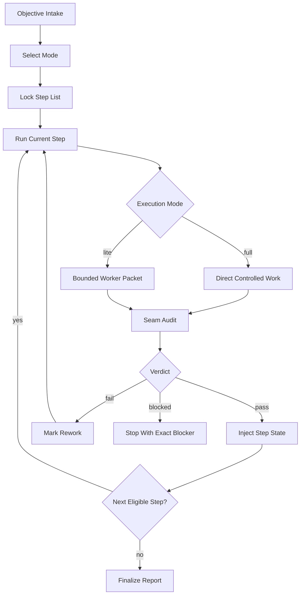

# tempgo Protocol Template

This page describes a generic, packetized documentation-and-change protocol for drift control. The model is designed for repositories that need more than ad hoc task prompts: they need a durable workstream contract, bounded worker packets, machine-readable continuation state, and seam audits between steps.

> **Generic-first rule**
>
> Treat the protocol as a reusable control pattern. Repository-specific paths, scripts, and policies are implementation details layered on top, not the protocol itself.

## Overview

The protocol splits work into four durable artifacts:

| Artifact | Role | Why it exists | Typical format |
| --- | --- | --- | --- |
| Protocol page | Defines the execution contract | Prevents teams from improvising process per task | Markdown |
| Workstream / step list | Declares ordered tasks, dependencies, ownership, and audit boundaries | Makes sequence and resume behavior explicit | Markdown or YAML |
| Step state | Stores runtime truth for the current workstream | Lets a paused or transferred session resume without guessing | JSON |
| Seam audit | Verifies a completed slice before continuation | Stops silent drift between packets | Markdown or JSON |

The operating principle is simple: broad work is orchestrated by a rigorous parent packet; narrow work is executed by tightly bounded child packets; every handoff crosses an explicit audit seam; the step list and step state remain the continuity source of truth.

> **What this prevents**
>
> The protocol is built to stop scope creep, hidden dependency drift, conversational plan loss, and false confidence after partial implementation.

## Operating Modes

Use distinct modes instead of one oversized prompt shape.

| Mode | Use when | Must own | Must return | Escalate when |
| --- | --- | --- | --- | --- |
| `full` orchestrator | Multi-step, cross-surface, risky, or resumable work | Sequence, branch or baseline discipline, next-task selection, audit gating | Updated step state, audit result, next task selection | Scope widens, blockers appear, or audit fails |
| `lite` worker | One bounded slice with low ambiguity | One owned surface or one tightly coupled slice | Tight handoff report only: outputs, checks, blockers, residual risks, next-step constraints | Hidden dependencies, policy ambiguity, or cross-surface expansion appears |
| `audit` seam check | After each completed slice or checkpoint | Scope compliance, acceptance status, seam compatibility, next-step readiness | `pass`, `fail`, or `blocked` with findings and handoff data | Independent review is required or confidence is low |
| `step-list` authority | Whenever work has more than one meaningful step | Order, dependencies, stop conditions, audit boundaries, ownership | Canonical sequence and current runtime state | Never replaced by chat memory |

Recommended trigger language:

```text
full: protocol-name: <multi-step objective>
lite: protocol-name-lite: <bounded task>
audit: protocol-name-audit: <checkpoint or completed slice>
```

## Workstream Shape

The workstream should be shaped as a loop, not a one-shot instruction burst.

| Phase | Full orchestrator responsibility | Durable output |
| --- | --- | --- |
| Intake | Restate objective, owned scope, forbidden scope, required references, stop conditions | Packet header |
| Mode selection | Decide whether the next slice is `full` only, `lite`, or `blocked` | Mode declaration |
| Step-list lock | Approve or update the ordered workstream plan before execution | Step list |
| Preflight | Verify baseline, branch or revision alignment, prerequisites, and open blockers | Preflight record |
| Execute | Run the current bounded slice only | Worker output or direct change |
| Seam audit | Verify acceptance, scope compliance, and next-step safety | Audit result |
| State inject | Write the execution and audit truth back into machine-readable state | Step state JSON |
| Continue or stop | Select the next eligible task, or halt with a concrete reason | Next-action decision |

Minimal loop:

1. Lock sequence.
2. Execute one bounded slice.
3. Audit the seam.
4. Inject state.
5. Continue only if the next slice is still well-defined.

## Step List And State Model

The step list is the static plan; the step state is the live record. They should agree on identifiers, dependencies, and audit boundaries.

### Step list fields

| Field | Required | Purpose |
| --- | --- | --- |
| `step_id` | Yes | Stable identifier used by state and audit outputs |
| `title` | Yes | Human-readable description of the slice |
| `mode` | Yes | `full`, `lite`, or another explicitly defined mode |
| `depends_on` | Yes | Prevents invalid out-of-order execution |
| `owned_scope` | Yes | Defines the exact files, modules, or surfaces the slice may touch |
| `acceptance_checks` | Yes | Defines how completion is judged |
| `audit_boundary` | Yes | States whether a seam audit is mandatory before continuation |
| `stop_conditions` | Yes | Forces an explicit return when assumptions break |

### Runtime state fields

| Field | Meaning |
| --- | --- |
| `status` | Current lifecycle state for the step |
| `attempt` | Retry counter for the current step |
| `last_worker_packet` | Identifier or path for the most recent execution packet |
| `last_audit_verdict` | `pass`, `fail`, `blocked`, or `not_run` |
| `blockers` | Facts preventing continuation |
| `residual_risks` | Known concerns accepted or awaiting follow-up |
| `next_step_constraints` | Inputs the next packet must honor |
| `evidence` | Commands, files, or outputs proving the step's current state |

### Status model

| Status | Meaning | Allowed next states |
| --- | --- | --- |
| `pending` | Not started and not eligible yet | `ready`, `blocked` |
| `ready` | Dependencies satisfied and can be launched | `in_progress`, `blocked` |
| `in_progress` | Active execution packet owns the slice | `audit_pending`, `blocked` |
| `audit_pending` | Execution finished; seam audit still required | `done`, `rework`, `blocked` |
| `rework` | Audit found defects but the slice remains bounded | `in_progress`, `blocked` |
| `done` | Acceptance and seam checks passed | none |
| `blocked` | Continuation is unsafe or impossible without intervention | `ready`, `in_progress` only after explicit unblock |

> **State discipline**
>
> Resume from the step state file, not from memory and not from the last chat message.

## Seam Audits

Seam audits are packet-local control points. They verify that the next step will inherit a coherent state instead of wishful thinking.

| Audit question | Why it matters | Typical evidence |
| --- | --- | --- |
| Did the slice stay inside owned scope? | Prevents stealth scope expansion | Diff, touched files, ownership map |
| Did the declared checks actually run? | Prevents "done" without proof | Command output, test results, screenshots, logs |
| Did the change preserve seam compatibility? | Prevents the next worker inheriting broken assumptions | Interface diff, schema check, doc update, build result |
| Are blockers or residual risks now explicit? | Prevents buried follow-up work | Audit report findings |
| Is the next task still bounded? | Prevents the parent packet from issuing unsafe next prompts | Updated constraints in state JSON |

Recommended verdict contract:

| Verdict | Meaning | Parent action |
| --- | --- | --- |
| `pass` | Slice is complete enough for the next planned step | Inject audit state and continue |
| `fail` | The slice did not meet acceptance or seam compatibility | Route to rework or halt |
| `blocked` | The next safe move is unclear or externally blocked | Stop and report exact blocker |

Example seam-audit output:

```json
{
  "verdict": "pass",
  "findings": [],
  "residual_risks": [
    "Downstream documentation still needs final wording review."
  ],
  "next_step_constraints": [
    "Do not widen the file set beyond docs/public/**.",
    "Treat the current heading structure as stable input."
  ],
  "handoff": {
    "next_step_id": "step-03",
    "mode": "lite",
    "objective": "Add repository example lane and templates without changing generic guidance."
  }
}
```

## In This Repository

This repository is only an example lane for the pattern above.

| Example surface in this workspace | Generic role in the protocol |
| --- | --- |
| `runbook-policy/studio/protocols/tempgo-protocol.md` | Full orchestrator contract |
| `runbook-policy/studio/protocols/tempgo-step-list-protocol.md` | Canonical sequence and runtime-state contract |
| `runbook-policy/studio/protocols/tempgo-lite-protocol.md` | Bounded worker packet |
| `runbook-policy/studio/protocols/tempgo-audit-protocol.md` | Packet-local seam audit |
| `drift-control-packet-public/*.md` | Public explanatory publication layer |

Concrete ideas modeled from the example lane:

- A parent packet, not the child worker, decides what task runs next.
- A lite worker stays narrow and returns across a seam instead of widening scope in place.
- Multi-step work uses a step list as sequence authority instead of conversational planning.
- Every checkpoint writes machine-readable state so pause and resume are deterministic.
- Packet-local audit is distinct from whole-repository audit.

> **Example-lane warning**
>
> Do not hard-code this repository's paths into your own implementation. Recreate the roles, not the filenames.

## Mermaid Diagram



## Key Snippets

Trigger and packet selection:

```text
Use full protocol when the workstream spans multiple steps, surfaces, or audit boundaries.
Use lite protocol only for one bounded slice with one owner and a clean return seam.
Run seam audit after every completed slice before selecting the next worker packet.
```

Tight lite-worker handoff:

```yaml
step_id: step-02
status: completed
outputs:
  - created docs/protocol/step-list-template.md
checks:
  - markdown lint passed
  - headings verified
blockers: []
residual_risks:
  - template has not yet been exercised on a live repo
next_step_constraints:
  - keep existing section names stable
  - do not introduce repo-specific assumptions
```

Orchestrator continuation rule:

```text
If state is current and the seam audit verdict is pass, continue to the next eligible step without asking for a new plan.
If verdict is fail or blocked, stop with the exact reason and required corrective action.
```

## Workstream Template

```md
# <Protocol Name> Workstream

## Objective
- <single sentence outcome>

## Scope
- Owned: <files, modules, directories, or surfaces>
- Forbidden: <explicit exclusions>

## Required References
- <authority docs, specs, tickets, decisions, schemas>

## Modes In Use
- Full orchestrator: yes/no
- Lite worker packets: yes/no
- Seam audits required: yes/no

## Global Stop Conditions
- <condition that forces return or escalation>

## Ordered Steps
| step_id | title | mode | depends_on | owned_scope | acceptance_checks | audit_boundary |
| --- | --- | --- | --- | --- | --- | --- |
| step-01 | <name> | full | none | <scope> | <checks> | required |
| step-02 | <name> | lite | step-01 | <scope> | <checks> | required |

## Completion Contract
- Final report must include changed surfaces, checks run, audit verdicts, residual risks, and the exact next action if incomplete.
```

## Step List Template

```md
| step_id | status | title | mode | depends_on | owned_scope | deliverable | acceptance_checks | stop_conditions | audit_boundary |
| --- | --- | --- | --- | --- | --- | --- | --- | --- | --- |
| step-01 | pending | Define protocol surfaces | full | none | docs/protocol/** | protocol draft | headings complete; role table present | missing references; unclear authority | required |
| step-02 | pending | Draft step list template | lite | step-01 | docs/protocol/templates/** | reusable template | example row included | file ownership unclear | required |
| step-03 | pending | Validate seam outputs | audit | step-02 | docs/protocol/** | audit report | evidence attached | checks unavailable | required |
```

## Step State JSON Template

```json
{
  "workstream_id": "replace-with-stable-id",
  "objective": "replace with one-sentence goal",
  "current_step_id": "step-01",
  "overall_status": "in_progress",
  "steps": {
    "step-01": {
      "status": "audit_pending",
      "attempt": 1,
      "mode": "full",
      "last_worker_packet": "packets/step-01.md",
      "last_audit_verdict": "not_run",
      "blockers": [],
      "residual_risks": [],
      "next_step_constraints": [
        "Do not widen scope before the step list is approved."
      ],
      "evidence": [
        "docs/protocol/protocol-template.md"
      ],
      "updated_at": "2026-03-13T00:00:00Z"
    }
  },
  "history": [
    {
      "timestamp": "2026-03-13T00:00:00Z",
      "step_id": "step-01",
      "event": "execution_completed",
      "note": "Drafted initial protocol skeleton."
    }
  ]
}
```

## Implementation Checklist

- Define one protocol family with at least `full`, `lite`, `audit`, and `step-list` roles.
- Standardize trigger phrases so operators do not invent new packet shapes ad hoc.
- Create a durable step-list format with stable `step_id` values.
- Create a machine-readable state file that uses the same step identifiers as the step list.
- Require seam audits after each completed slice or declared checkpoint.
- Keep lite packets single-slice and force return on ambiguity, hidden dependency drift, or scope expansion.
- Make parent packets responsible for continuation, not child workers.
- Store enough evidence in state or linked artifacts that a new session can resume safely.
- Distinguish packet-local seam audit from whole-repository or release audit.
- Publish a reader-facing explanation of the system so the protocol does not live only in prompts.

## Repo-Agnostic Build Prompt

```text
Build and use a packetized documentation-and-change protocol in this repository. Do not assume any local skills, policy bundles, or existing protocol files.

Goals:
1. Create a reusable protocol family for drift-controlled work with four roles:
   - a full orchestrator packet for multi-step or risky work
   - a lite worker packet for one bounded slice
   - a seam-audit packet for post-step verification
   - a step-list plus machine-readable state model for sequence authority and resume behavior
2. Keep the design generic and repository-agnostic. If repo-specific examples are needed, label them as examples only.
3. Prevent ad hoc planning drift by making the step list and state files the continuity source of truth.

Deliverables:
- one public-facing protocol overview page in markdown
- one step-list template in markdown
- one step-state template in JSON
- one seam-audit template in markdown or JSON
- one short operator guide that explains when to use full vs lite mode

Protocol requirements:
- Full orchestrator mode must own sequence selection, stop conditions, audit gating, and continuation decisions.
- Lite mode must stay narrow, touch only its declared scope, and return a tight handoff report with outputs, checks, blockers, residual risks, and next-step constraints.
- Seam audit must run after each completed slice or checkpoint and return exactly one verdict: pass, fail, or blocked.
- Multi-step work must execute from a declared step list with stable step IDs, dependencies, owned scope, acceptance checks, audit boundaries, and stop conditions.
- Machine-readable state must record current step, per-step status, attempts, last audit verdict, blockers, residual risks, evidence, and a history log.
- Resume behavior must read the state file, not chat history.
- The public docs must explain the system in concise, dense prose and include at least one table, one mermaid diagram, and concrete snippets.

Implementation guidance:
- Choose sensible paths in this repo for docs, templates, and state examples.
- If related docs already exist, align with them instead of duplicating terminology.
- Keep all new artifacts editable by humans and parseable by automation.
- Prefer explicit stop conditions over permissive continuation rules.

Execution tasks:
1. Inspect the repository and identify the best location for protocol docs and templates.
2. Draft the public overview page first so the model is clear.
3. Create the step-list, state, and seam-audit templates.
4. Cross-check that field names match across all artifacts.
5. Summarize how an operator would run a multi-step workstream and how a paused workstream resumes.

Output requirements:
- Report every file you created or changed.
- Summarize any assumptions.
- If the repo lacks a suitable place for these artifacts, propose one and proceed consistently.
```
